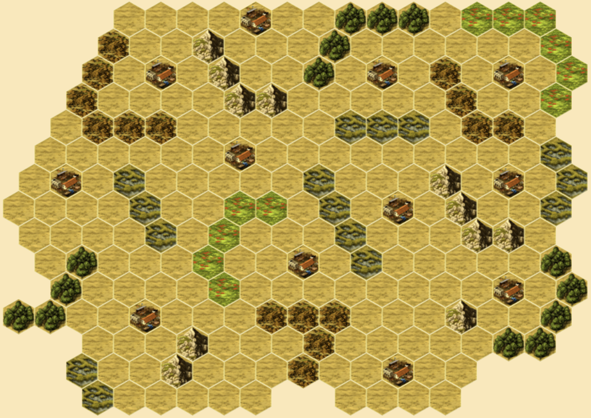

# Hacienda Maps
[Hacienda](https://boardgamegeek.com/boardgame/19100/hacienda) is a boardgame by Wolfgang Kramer.  It can be played on [Yucata](https://www.yucata.de/en) with custom maps.  These maps are custom crafted and available for your repeated exploration, if you enjoy the unique challenge any one presents.

## Asymmetrical
### Fjords

### Bryce

### Four Kingdoms

### Cinco

## Twofer

## Bridge

## Divide

## Bait

## Slalom

## Symmetrical (Mostly)
### Eight

### Candy

### Everest

### Treasure Map

### Bull Market

### Honey

## License
MIT
