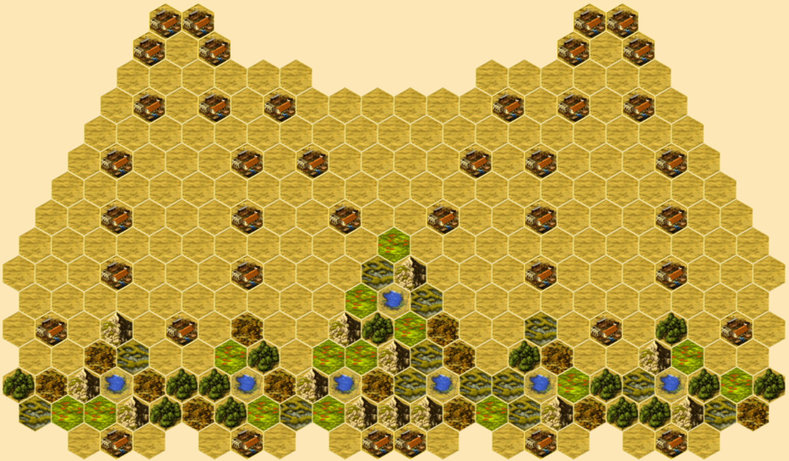
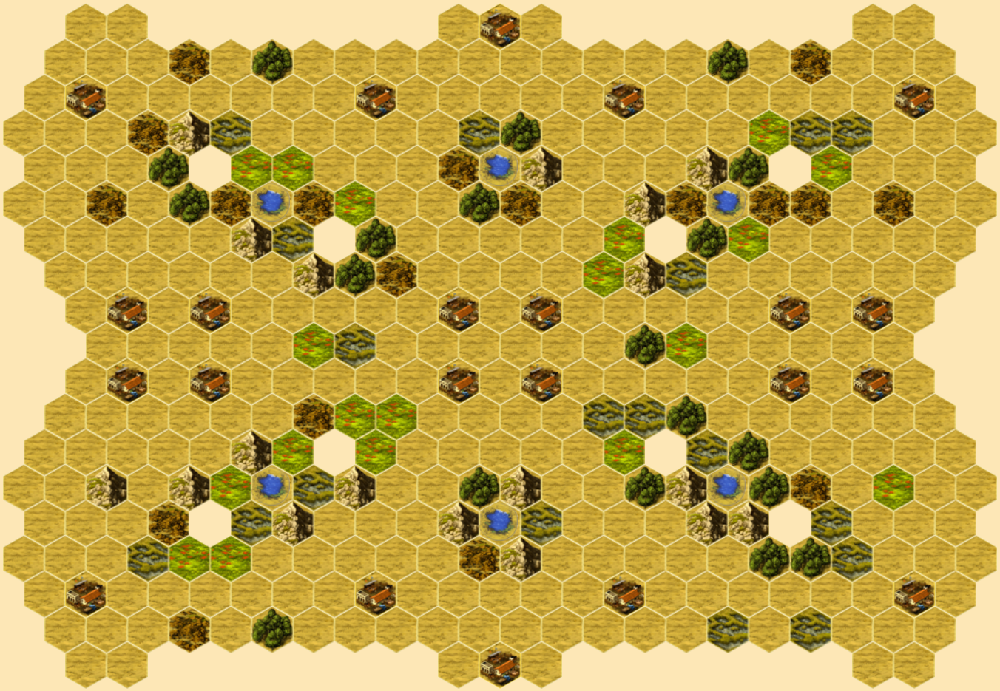
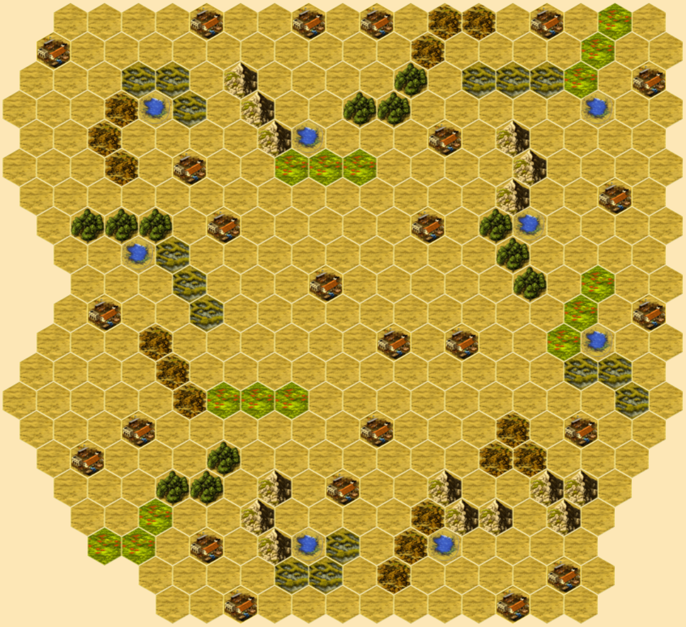
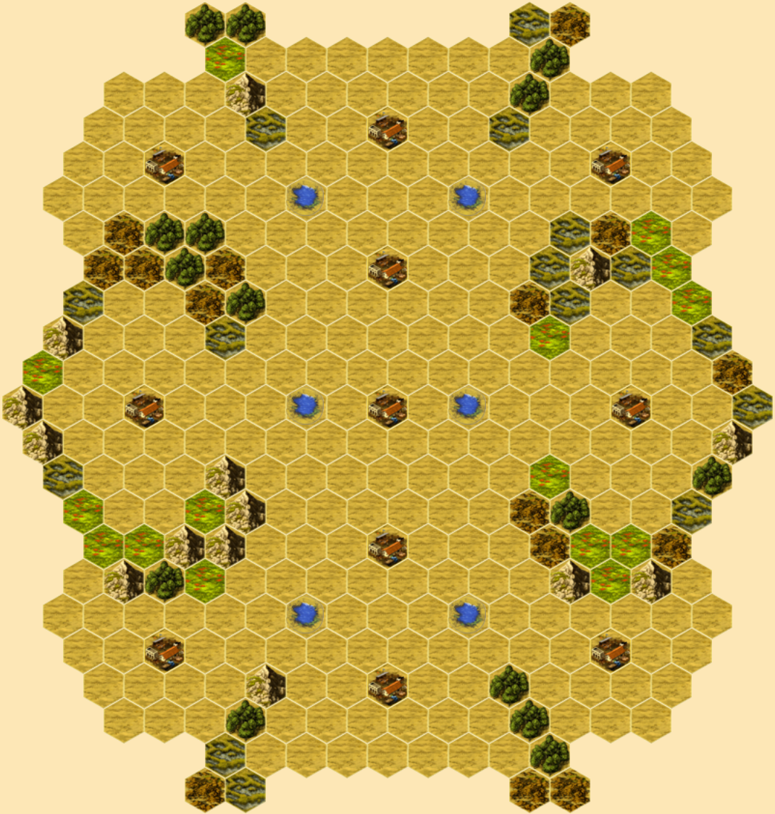
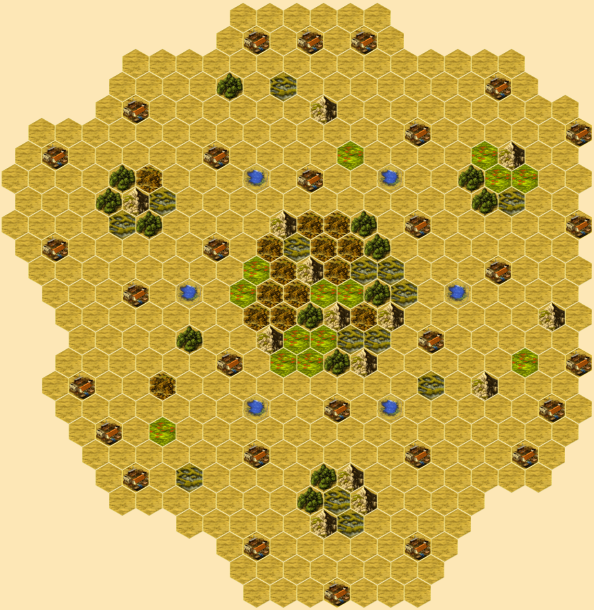
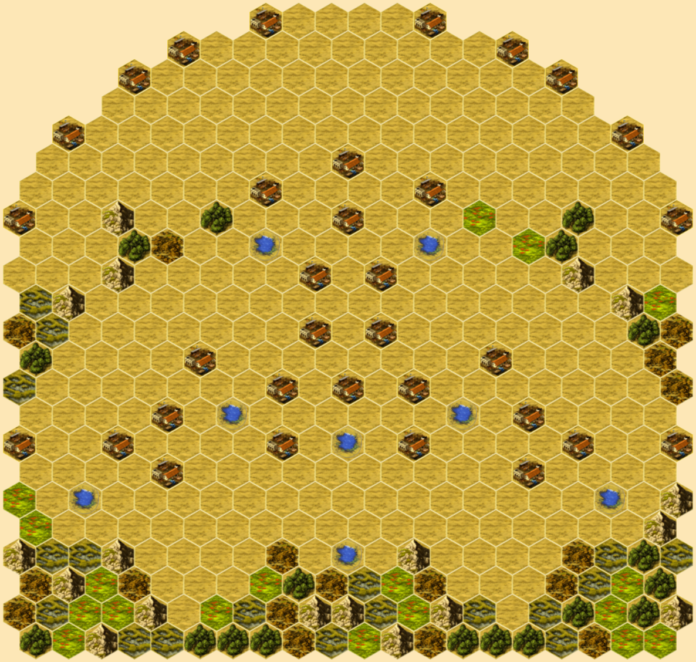
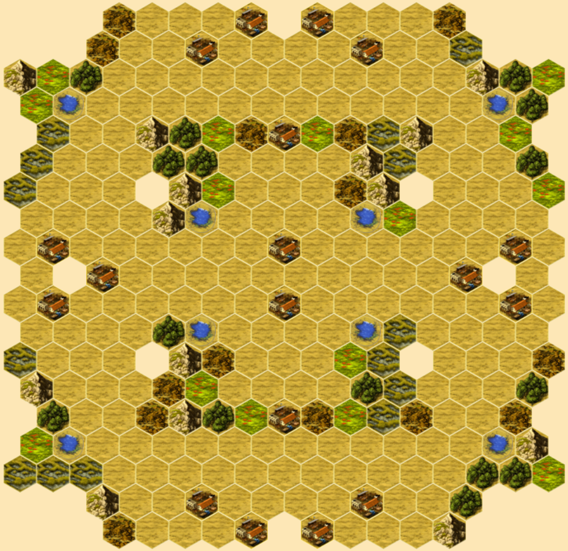
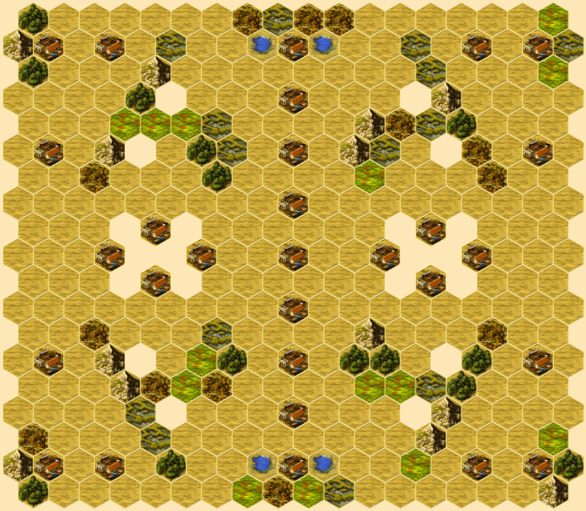

# Hacienda Maps
[Hacienda](https://boardgamegeek.com/boardgame/19100/hacienda) is a boardgame by Wolfgang Kramer.  It can be played on [Yucata](https://www.yucata.de/en) or [SpielByWeb](http://www.spielbyweb.com) with custom maps.

The following maps were built to explore a variety of challenges.  Looking at each you will get a sense of good player counts.  Just ask, if this were played with `n` players how would I feel if I were player `n`?  Use your judgment.

The maps explore various ideas.  The titles may offer clues.  I won't attempt to explain each since discovery is part of the fun, but suffice to say playing is learning.

### Adullam

### Alternate Reality

### Ararat

### Asteroids

### Bait

### Bitter Root

### Bonanza

### Brave

### Bridge

### Bryce

### Bull Market

### Bullets

### Bullseye

### Butterfly

### Candy

### Choking Tiger

### Church

### Cinco

### Cinnamon

### Clover

### Comb

### Courtyard

### Crosshair

### Delve

### Diamond Mine

### Dorm

### Duel

### Eight

### Elemental

### Everest

### Far Reaches

### Files

### Fjords

### Flank Steak

### Four Kingdoms

### Four Kingdoms Redux

### Four Worlds

### Ginger Chew

### Grade

### Great Divide

### Hive

### Honey

### Irrigate

### Launch

### Milky Way

### Moat

### One Two Three

### Outliers

### Parcheesi

### Peachy

### Peas and Carrots

### Pens

### Picture Frame

### Planetary

### Plank

### Reference Pear

### River

### Sand

### Seed

### Slalom

### Socket

### Sound Barrier

### Specs

### Stopgap

### Sun

### Tetons

### Treasure Map

### Triad

### Twofer

### U-Turn

### Wat

### Wayfinder

### Yin & Yang

### Zion

## License
[![CC BY 4.0][cc-by-shield]][cc-by]

This work is licensed under a
[Creative Commons Attribution 4.0 International License][cc-by].

[![CC BY 4.0][cc-by-image]][cc-by]

[cc-by]: http://creativecommons.org/licenses/by/4.0/
[cc-by-image]: https://i.creativecommons.org/l/by/4.0/88x31.png
[cc-by-shield]: https://img.shields.io/badge/License-CC%20BY%204.0-lightgrey.svg
