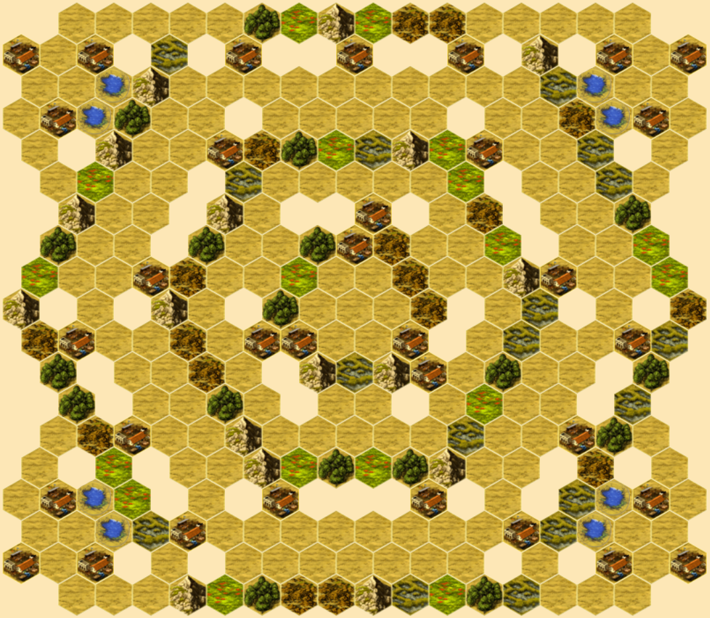

# Hacienda Maps
[Hacienda](https://boardgamegeek.com/boardgame/19100/hacienda) is a boardgame by Wolfgang Kramer.  It can be played on [Yucata](https://www.yucata.de/en) or [SpielByWeb](http://www.spielbyweb.com) with custom maps.  These maps are custom crafted around unique challenges and available for your repeated exploration.

Looking at each map you will get a sense of good player counts.  Just ask, if this were played with `n` players how would I feel if I were player `n`?  In the symmetrical maps it's a matter of whether the map is suitable for odd player counts.  Use your judgment.

Each map was built around an idea.  The title may offer a clue.  I won't attempt to explain each since discovery is part of the fun, but suffice to say a few plays will give you a sense of it.  In Peas & Carrots, as an example, and since most maps use heterogeneous areas, I wanted to explore the difficulty of building a position among homogeneous patches of terrain.

In some of my earlier maps (i.e. Fjords) I made the pampas channels too narrow for placing watering holes.  The maps work but they offer a different kind of play.  In later maps, I loosened the pampas areas to make water useful again.

Some maps have magnetic areas just begging you to claim them.  But how good are those positions, really?  That's the question!

## Asymmetrical
### Wayfinder

### Stopgap

### Cinnamon

### Exigent Circumstances

### Hedgerow

### Brave

### Outliers

### Fjords

### Bryce

### Four Kingdoms

### Four Kingdoms Redux

### Cinco

### Twofer

### Bridge

### Peas and Carrots

### Bait

### Slalom

### River

### Bonanza

## Semi-Symmetrical
### Hive

### Socket

### Bullseye

### Picture Frame

### Elemental

### Crosshair

### Plank

### Eight

### Launch

### Candy

### Everest

### Treasure Map

### Bull Market

### Honey

### Asteroids

### Duel

### Butterfly

## License
MIT
