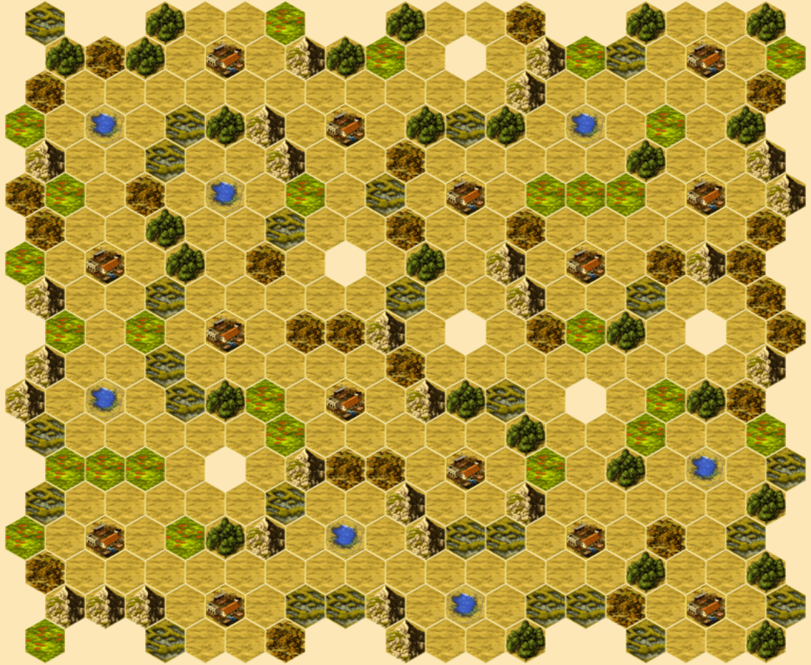
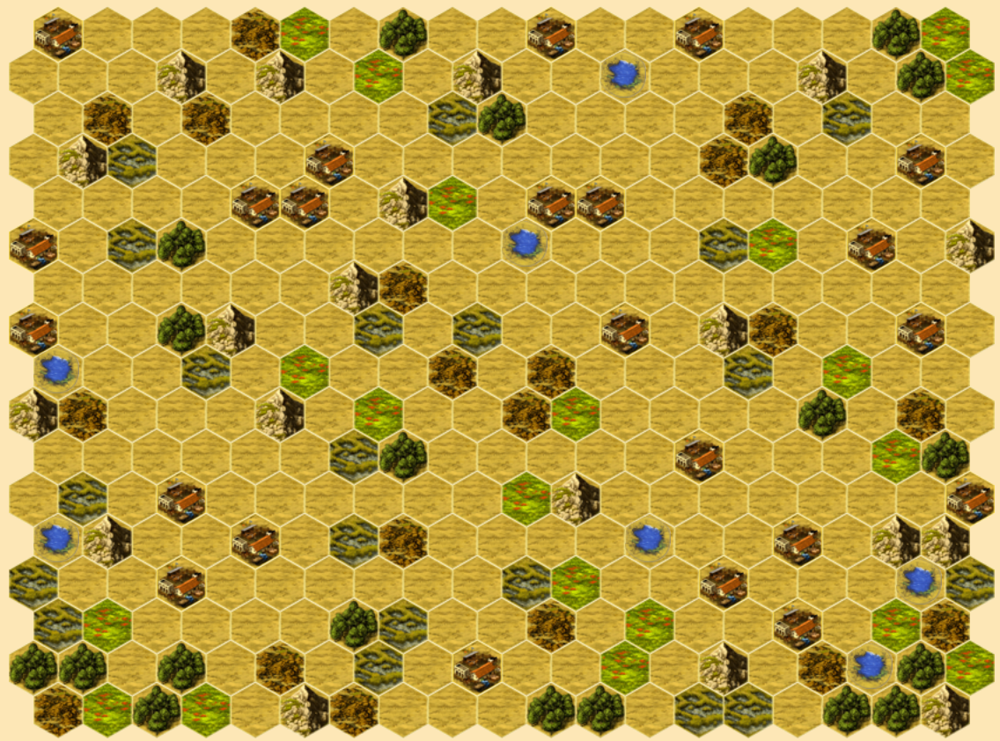
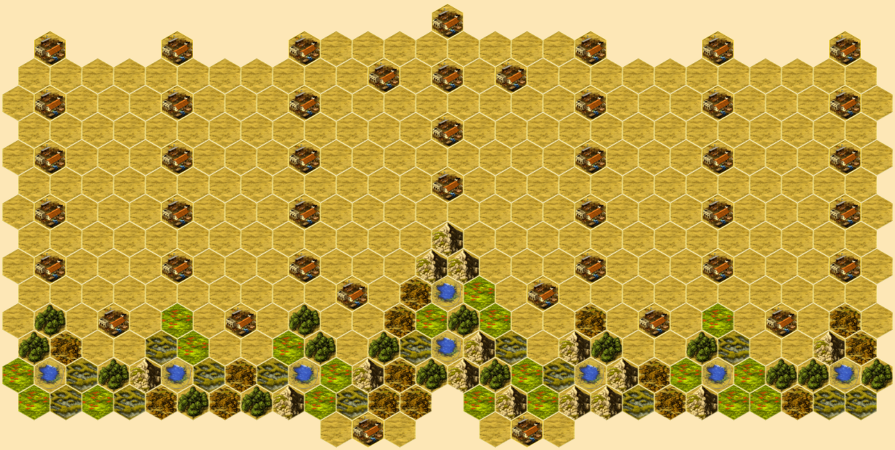
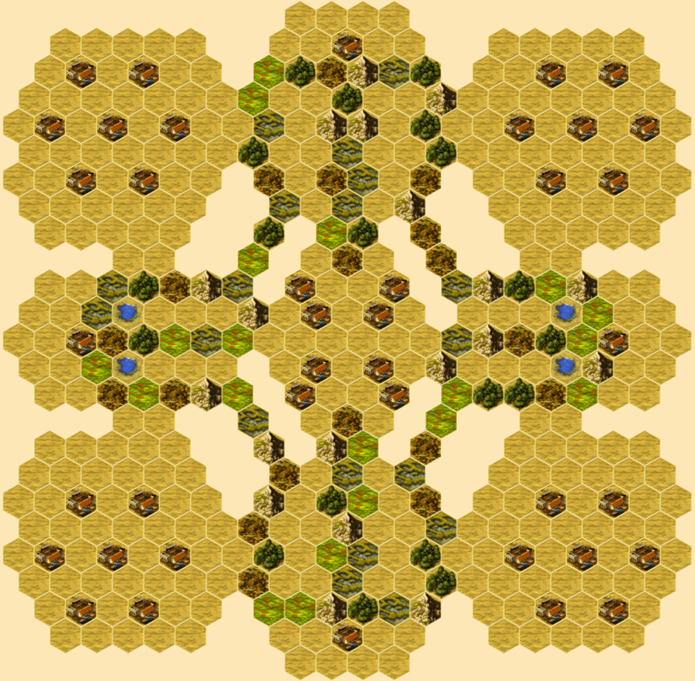
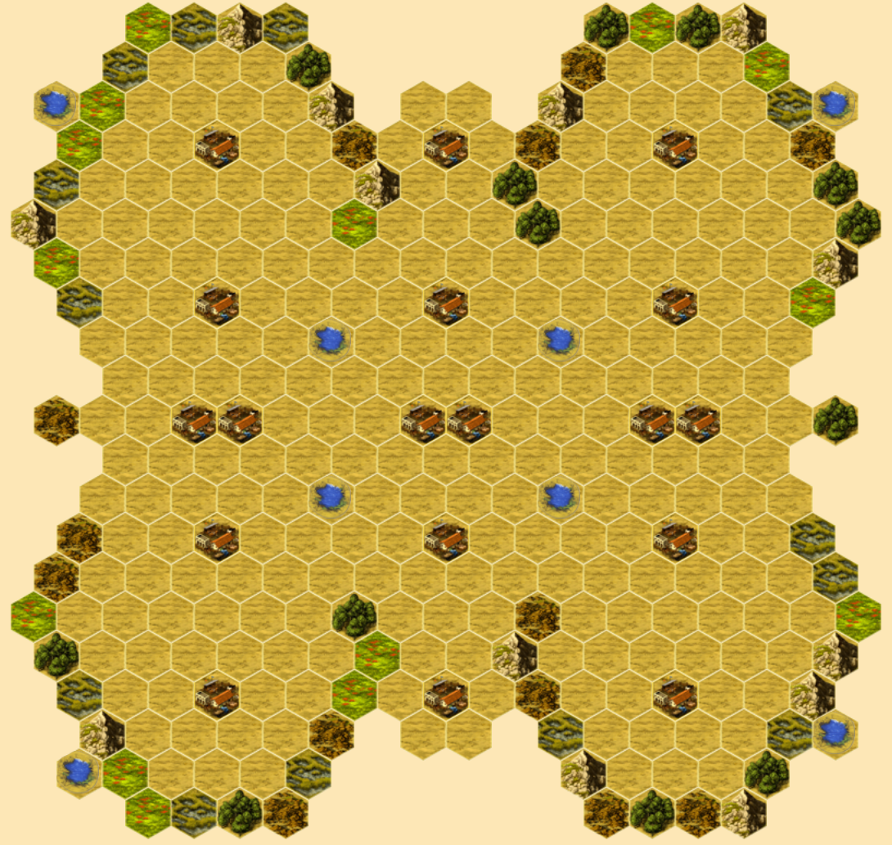

# Hacienda Maps
[Hacienda](https://boardgamegeek.com/boardgame/19100/hacienda) is a boardgame by Wolfgang Kramer.  It can be played on [Yucata](https://www.yucata.de/en) or [SpielByWeb](http://www.spielbyweb.com) with custom maps.

The following maps were built to explore a variety of challenges.  Looking at each you will get a sense of good player counts.  Just ask, if this were played with `n` players how would I feel if I were player `n`?  In the symmetrical maps it's a matter of whether the map is suitable for odd player counts.  Use your judgment.

Each map presents an idea.  Its title may offer a clue.  I won't attempt to explain each since discovery is part of the fun, but suffice to say playing is learning.

## Asymmetrical
### Pens

### Wayfinder

### Stopgap

### Cinnamon

### Choking Tiger

### Brave

### Outliers

### Fjords

### Far Reaches

### Bryce

### Great Divide

### Alternate Reality

### Four Kingdoms

### Four Kingdoms Redux

### Four Worlds

### Cinco

### Twofer

### Bridge

### Peas and Carrots

### Bait

### Slalom

### River

### Bitter Root

### Bonanza

## Semi-Symmetrical
### Hive

### Comb

### Diamond Mine

### Irrigate

### Sun

### Zion

### Socket

### Bullseye

### Picture Frame

### Reference Pear

### Triad

### Files

### Elemental

### Crosshair

### Plank

### Eight

### Launch

### Candy

### Everest

### Parcheesi

### Church

### Treasure Map

### Bull Market

### Honey

### Sand

### Asteroids

### Duel

### Butterfly

## License
[![CC BY 4.0][cc-by-shield]][cc-by]

This work is licensed under a
[Creative Commons Attribution 4.0 International License][cc-by].

[![CC BY 4.0][cc-by-image]][cc-by]

[cc-by]: http://creativecommons.org/licenses/by/4.0/
[cc-by-image]: https://i.creativecommons.org/l/by/4.0/88x31.png
[cc-by-shield]: https://img.shields.io/badge/License-CC%20BY%204.0-lightgrey.svg
